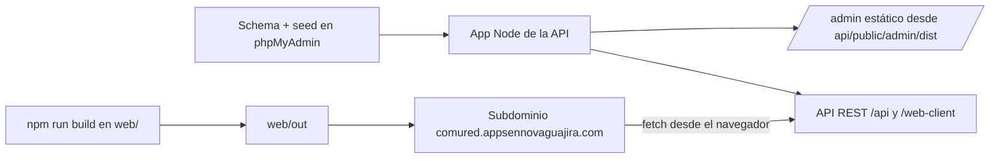

# Proceso de despliegue — Comured

Guía paso a paso para desplegar la plataforma en Hostinger (plan Cloud Startup).

## 0. Requisitos previos

- Cuenta Hostinger con plan Cloud Startup activo.
- Acceso a hPanel, phpMyAdmin y el terminal SSH del plan.
- Repositorio `https://github.com/Alexhumme/guajira-platform` actualizado (rama `main`).

## 1. Base de datos

1. En hPanel → Bases de datos MySQL, crear la base `comured` (charset `utf8mb4`).
2. En phpMyAdmin, importar en orden:
   - `api/sql/schema.sql` (estructura)
   - `api/sql/seed.sql` (datos iniciales)
3. Anotar usuario, contraseña, host (normalmente `localhost`) y puerto `3306`.

## 2. API (backend Node.js)

1. hPanel → Websites → **Node.js Apps** → agregar aplicación desde GitHub (o subir archivos por FTP).
2. Configuración:
   - **Directorio raíz**: `api/`
   - **Comando de inicio**: `node server.js` (o `npm start`)
   - **Versión de Node**: 20.x (o 22.x)
3. Variables de entorno (en el panel de la app, sin subir `.env`):

```
DB_HOST=localhost
DB_USER=<usuario>
DB_PASSWORD=<password>
DB_NAME=comured
DB_PORT=3306
PORT=5000
NODE_ENV=production
SESSION_SECRET=<cadena_aleatoria_larga>
ADMIN_BOOTSTRAP_USER=admin
ADMIN_BOOTSTRAP_PASSWORD=<clave_fuerte>
CORS_ORIGINS=https://comured.appsennovaguajira.com
MAX_FILE_SIZE=10MB
```

4. Deploy. Verificar `https://<dominio-api>/` → debe responder la vista estática, `/admin` → panel, `/web-client/municipios` → JSON.
5. Importante: **no borrar `api/public/uploads/`** en redespliegues; es donde quedan los archivos subidos.

## 3. Frontend web (sitio estático)

1. En local, definir `NEXT_PUBLIC_API_URL=https://<dominio-api>` en `web/.env`.
2. Ejecutar `npm run build` en `web/` → genera `web/out/`.
3. Subir el contenido de `web/out/` al document root del subdominio (p. ej. `public_html/comured`).
4. Verificar que `/comunidades`, `/marketplace`, `/publicaciones`, `/proyecto` carguen y que el navegador pueda llamar a la API (CORS).

## 4. Panel de administración (estático, servido por la API)

1. En local: `npm run build` en `admin-react/` → genera `api/public/admin/dist`.
2. Si el deploy de la API es por Git, incluya el `dist` generado (o ejecute el build en el servidor antes de arrancar).
3. Acceder vía `https://<dominio-api>/admin/`.

## 5. Post-despliegue

- Crear el primer administrador con `POST /api/auth/bootstrap` (usuario y clave de `ADMIN_BOOTSTRAP_*`), luego cambiar la clave.
- Rotar `SESSION_SECRET` y credenciales por defecto.
- Verificar login del panel y que las imágenes de `/uploads/...` se vean en el sitio.
- Configurar HTTPS (Let’s Encrypt en hPanel) para que las cookies `secure` funcionen.

## 6. Actualizaciones futuras

1. Commit y push a `main`.
2. Redesplegar la app Node desde hPanel.
3. Regenerar `web/out` con la nueva `NEXT_PUBLIC_API_URL` y re-subirlo.

Diagrama del flujo (Mermaid):


