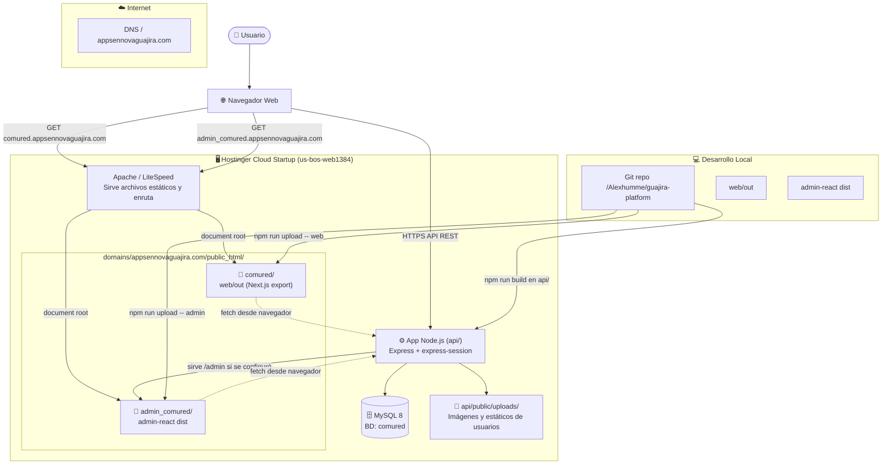

# Diagrama de Despliegue

```mermaid
graph TD
  Usuario(["👤 Usuario"]) --> Browser["🌐 Navegador Web"]

  subgraph Internet["☁️ Internet"]
    DNS["DNS / appsennovaguajira.com"]
  end

  subgraph Hostinger["🖥️ Hostinger Cloud Startup (us-bos-web1384)"]
    Apache["Apache / LiteSpeed<br/>Sirve archivos estáticos y enruta"]
    subgraph Domains["domains/appsennovaguajira.com/public_html/"]
      ComuredStatic["📁 comured/<br/>web/out (Next.js export)"]
      AdminStatic["📁 admin_comured/<br/>admin-react dist"]
    end
    ApiNode["⚙️ App Node.js (api/)<br/>Express + express-session"]
    MySQL[("🗄️ MySQL 8<br/>BD: comured")]
    Uploads["📁 api/public/uploads/<br/>Imágenes y estáticos de usuarios"]
  end

  Browser -- "GET comured.appsennovaguajira.com" --> Apache
  Apache -->|document root| ComuredStatic
  Browser -- "GET admin_comured.appsennovaguajira.com" --> Apache
  Apache -->|document root| AdminStatic

  Browser -->|HTTPS API REST| ApiNode
  ApiNode --> MySQL
  ApiNode --> Uploads
  ApiNode -->|sirve /admin si se configuró| AdminStatic

  ComuredStatic -.->|fetch desde navegador| ApiNode
  AdminStatic -.->|fetch desde navegador| ApiNode

  subgraph Dev["💻 Desarrollo Local"]
    Repo["Git repo /Alexhumme/guajira-platform"]
    BuildWeb["web/out"]
    BuildAdmin["admin-react dist"]
    Repo -->|npm run upload -- web| ComuredStatic
    Repo -->|npm run upload -- admin| AdminStatic
    Repo -->|npm run build en api/| ApiNode
  end
```
