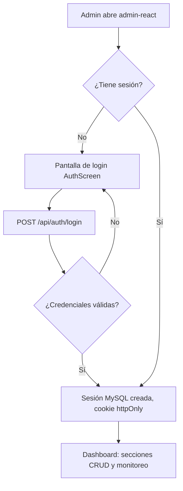
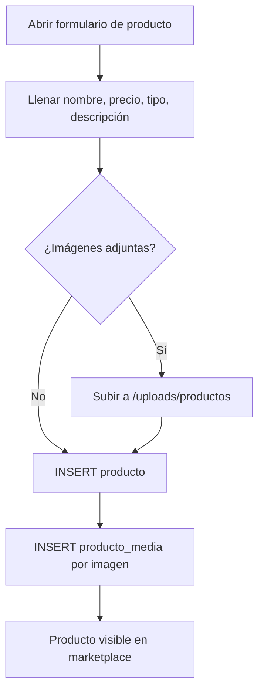
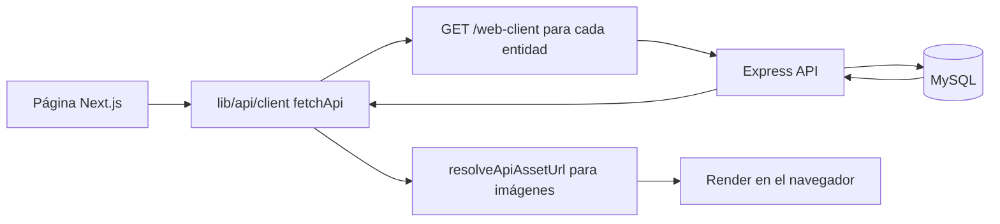
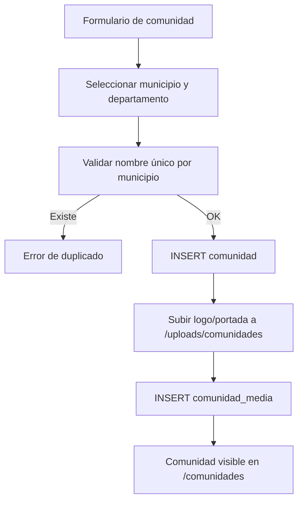

# Diagramas de Flujo

## 1. Autenticación del administrador

```mermaid
flowchart TD
  A[Admin abre admin-react] --> B{¿Tiene sesión?}
  B -- No --> C[Pantalla de login AuthScreen]
  C --> D[POST /api/auth/login]
  D --> E{¿Credenciales válidas?}
  E -- No --> C
  E -- Sí --> F[Sesión MySQL creada, cookie httpOnly]
  B -- Sí --> F
  F --> G[Dashboard: secciones CRUD y monitoreo]
```

## 2. Crear un producto (miembro/admin)

```mermaid
flowchart TD
  A[Abrir formulario de producto] --> B[Llenar nombre, precio, tipo, descripción]
  B --> C{¿Imágenes adjuntas?}
  C -- Sí --> D[Subir a /uploads/productos]
  C -- No --> E[INSERT producto]
  D --> E
  E --> F[INSERT producto_media por imagen]
  F --> G[Producto visible en marketplace]
```

## 3. Consumo público del sitio (web)

```mermaid
flowchart LR
  A[Página Next.js] --> B[lib/api/client fetchApi]
  B --> C[GET /web-client para cada entidad]
  C --> D[Express API]
  D --> E[(MySQL)]
  E --> D --> B
  B --> F[resolveApiAssetUrl para imágenes]
  F --> G[Render en el navegador]
```

## 4. Registro de una comunidad (CRUD admin)

```mermaid
flowchart TD
  A[Formulario de comunidad] --> B[Seleccionar municipio y departamento]
  B --> C[Validar nombre único por municipio]
  C -- Existe --> D[Error de duplicado]
  C -- OK --> E[INSERT comunidad]
  E --> F[Subir logo/portada a /uploads/comunidades]
  F --> G[INSERT comunidad_media]
  G --> H[Comunidad visible en /comunidades]
```
