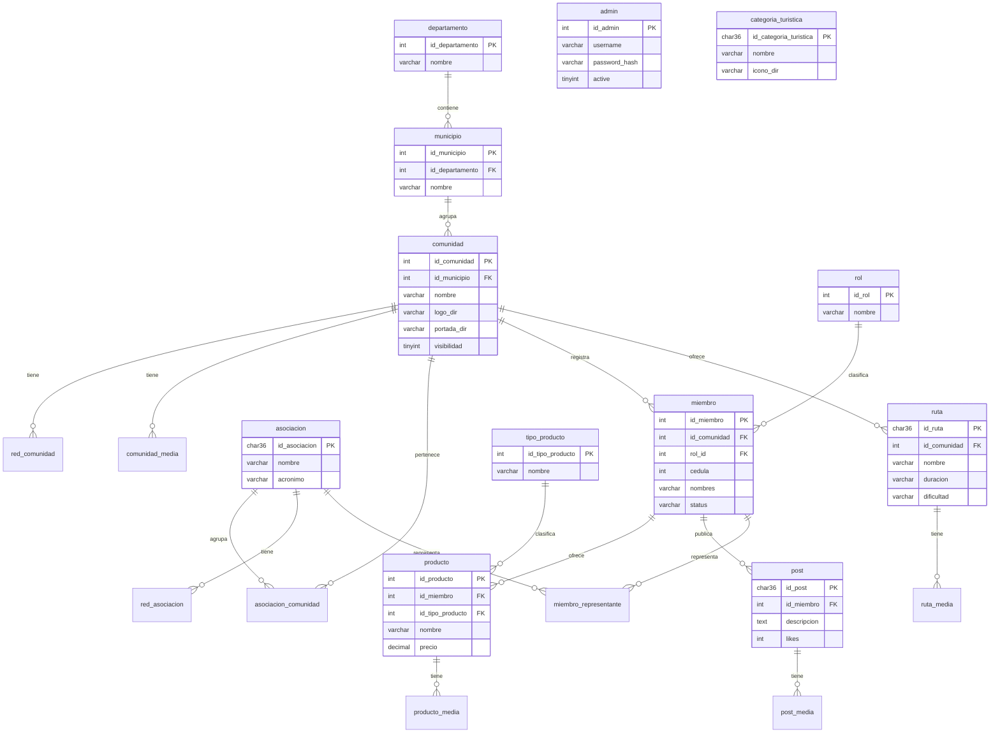

# Diagrama de Tablas (Entidad-Relación)

```mermaid
erDiagram
  departamento ||--o{ municipio : contiene
  municipio ||--o{ comunidad : agrupa
  comunidad ||--o{ red_comunidad : tiene
  comunidad ||--o{ comunidad_media : tiene
  comunidad ||--o{ asociacion_comunidad : pertenece
  asociacion ||--o{ asociacion_comunidad : agrupa
  asociacion ||--o{ red_asociacion : tiene
  comunidad ||--o{ miembro : registra
  rol ||--o{ miembro : clasifica
  miembro ||--o{ producto : ofrece
  tipo_producto ||--o{ producto : clasifica
  producto ||--o{ producto_media : tiene
  miembro ||--o{ post : publica
  post ||--o{ post_media : tiene
  comunidad ||--o{ ruta : ofrece
  ruta ||--o{ ruta_media : tiene
  asociacion ||--o{ miembro_representante : representa
  miembro ||--o{ miembro_representante : representa
  admin {
    int id_admin PK
    varchar username
    varchar password_hash
    tinyint active
  }
  rol {
    int id_rol PK
    varchar nombre
  }
  tipo_producto {
    int id_tipo_producto PK
    varchar nombre
  }
  departamento {
    int id_departamento PK
    varchar nombre
  }
  municipio {
    int id_municipio PK
    int id_departamento FK
    varchar nombre
  }
  comunidad {
    int id_comunidad PK
    int id_municipio FK
    varchar nombre
    varchar logo_dir
    varchar portada_dir
    tinyint visibilidad
  }
  miembro {
    int id_miembro PK
    int id_comunidad FK
    int rol_id FK
    int cedula
    varchar nombres
    varchar status
  }
  producto {
    int id_producto PK
    int id_miembro FK
    int id_tipo_producto FK
    varchar nombre
    decimal precio
  }
  post {
    char36 id_post PK
    int id_miembro FK
    text descripcion
    int likes
  }
  ruta {
    char36 id_ruta PK
    int id_comunidad FK
    varchar nombre
    varchar duracion
    varchar dificultad
  }
  asociacion {
    char36 id_asociacion PK
    varchar nombre
    varchar acronimo
  }
  categoria_turistica {
    char36 id_categoria_turistica PK
    varchar nombre
    varchar icono_dir
  }
```
