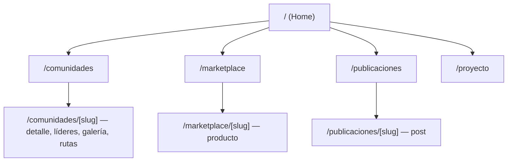
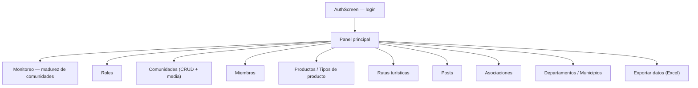
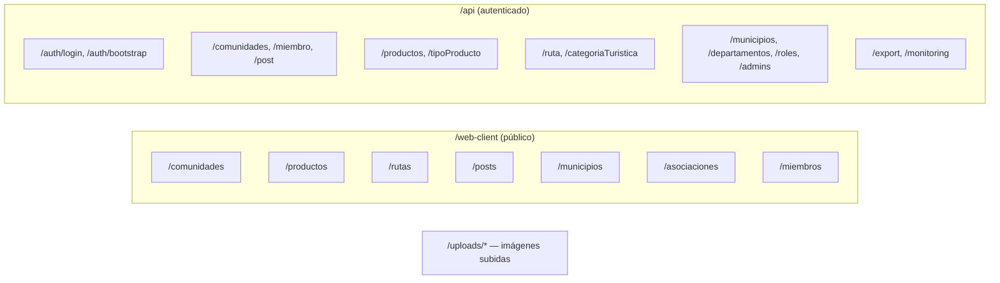

# Diagrama de Vistas

## Sitio público (`web/`)

```mermaid
graph TD
  Inicio["/ (Home)"] --> Com["/comunidades"]
  Inicio --> Mkt["/marketplace"]
  Inicio --> Pub["/publicaciones"]
  Inicio --> Pro["/proyecto"]
  Com --> ComD["/comunidades/[slug] — detalle, líderes, galería, rutas"]
  Mkt --> MktD["/marketplace/[slug] — producto"]
  Pub --> PubD["/publicaciones/[slug] — post"]
```

## Panel de administración (`admin-react/`)

```mermaid
graph TD
  Login["AuthScreen — login"] --> Panel["Panel principal"]
  Panel --> Mon["Monitoreo — madurez de comunidades"]
  Panel --> Roles["Roles"]
  Panel --> Com["Comunidades (CRUD + media)"]
  Panel --> Mie["Miembros"]
  Panel --> Prod["Productos / Tipos de producto"]
  Panel --> Rut["Rutas turísticas"]
  Panel --> Post["Posts"]
  Panel --> Aso["Asociaciones"]
  Panel --> Geo["Departamentos / Municipios"]
  Panel --> Exp["Exportar datos (Excel)"]
```

## API (`api/`)

```mermaid
graph LR
  subgraph WebClient["/web-client (público)"]
    W1["/comunidades"]
    W2["/productos"]
    W3["/rutas"]
    W4["/posts"]
    W5["/municipios"]
    W6["/asociaciones"]
    W7["/miembros"]
  end
  subgraph AdminAPI["/api (autenticado)"]
    A1["/auth/login, /auth/bootstrap"]
    A2["/comunidades, /miembro, /post"]
    A3["/productos, /tipoProducto"]
    A4["/ruta, /categoriaTuristica"]
    A5["/municipios, /departamentos, /roles, /admins"]
    A6["/export, /monitoring"]
  end
  Static["/uploads/* — imágenes subidas"]
```
