# Formularios del panel de administración

Los formularios están centralizados en `admin-react/` y se generan a partir de la configuración de cada sección en `admin-react/src/lib/sections.ts`. El componente que los renderiza es `admin-react/src/components/EntityModal/`.

## Tipos de campo (`FieldType`)

| Tipo | Descripción | Ejemplo |
|---|---|---|
| `text` | Texto corto | Nombre, dirección |
| `number` | Numérico | Precio, likes, cédula |
| `textarea` | Texto largo multilínea | Descripción |
| `checkbox` | Booleano | `visibilidad` / `active` |
| `date` | Fecha (se normaliza a `YYYY-MM-DD`) | `fecha_fundacion` |
| `select` | Select alimentado por `optionSource` o `options` | Municipio, rol, tipo de producto |
| `password` | Contraseña | Alta de admin |
| `media` | Gestor de recursos anidados (`MediaField`) | Logos, galerías, avatares |
| `subcrud` | Lista editable de subexpendencias (`SubcrudField`) | Redes sociales, comunidades de una asociación |

Definición del tipo en `admin-react/src/types.ts`:

```ts
export type FormField = {
  key: string; label: string; type?: FieldType
  required?: boolean; defaultValue?: string | number | boolean | null
  options?: Array<{ value: string; label: string }>; optionSource?: string
  nestedEndpoint?: string; nestedCollectionKey?: string; nestedListKey?: string
  nestedFields?: FormField[]
  allowUpload?: boolean; allowUrl?: boolean; allowExisting?: boolean
  existingSource?: string; uploadEndpoint?: string
}
```

## Campos especiales

### `select` con `optionSource`
Carga las opciones vía API en caliente (`fetchApi` con `credentials: 'include'`) y construye `{ value, label }` con `guessOptionValue` / `guessOptionLabel` (`EntityModal/helpers.ts`). Ejemplos: `/api/departamentos`, `/api/municipios`, `/api/comunidades`, `/api/miembros`, `/api/roles`, `/api/tipos-producto`.

### `media` (MediaField)
Permite tres orígenes, controlados por flags:

| Flag | Efecto |
|---|---|
| `allowUpload` | Seleccionar archivo local → se convierte a DataURL con `fileToDataURL` |
| `allowUrl` | Pegar una URL externa |
| `allowExisting` | Elegir un recurso ya subido listándolo desde `existingSource` |
| `uploadEndpoint` | Endpoint POST al que se envía el archivo al guardar |

Cada item mantiene `{ id?, isNew?, isExisting?, fileData?, fileName? }` en `NestedItem`.

### `subcrud` (SubcrudField)
Lista de filas con sus propios `nestedFields` (que pueden ser `text`, `select`, etc.). Soporta agregar, editar y marcar como eliminado. Usa `interpolatePath('{...}')` para construir URLs como `/api/comunidades/{id_comunidad}/redes`.

## Formularios por sección

| Sección | Endpoint | Campos principales | Campos especiales |
|---|---|---|---|
| Monitoreo | `/api/monitoring/comunidades` | Sin mutación (solo lectura) | — |
| Roles | `/api/roles` | `nombre*` (text) | — |
| Tipos de producto | `/api/tipos-producto` | `nombre*` (text) | — |
| Departamentos | `/api/departamentos` | `nombre*` (text) | — |
| Municipios | `/api/municipios` | `nombre*`, `id_departamento*` | `select` de departamentos |
| Comunidades | `/api/comunidades` | `nombre*`, `id_municipio*`, descripción, dirección, contacto, fecha, visible | `media` (recursos, `existingSource: /api/comunidades/uploads`) y `subcrud` de redes (`red_social*`, `usuario`, `link`) |
| Asociaciones | `/api/asociaciones` | nombre*, acrónimo, teléfono, correo, representante SENA, visible | `media` de logo (`uploadEndpoint: /api/asociaciones/upload`), `subcrud`s anidados: comunidades vinculadas, representantes, redes |
| Miembros | `/api/miembros` | `nombres*`, `cedula*` (number), `id_comunidad*`, `rol_id*`, fecha, género, contacto, estado | `media` de avatar (solo upload, `uploadEndpoint: /api/miembros/upload`) |
| Admins | `/api/admins` | `username*`, `password*`, activo | — |
| Productos | `/api/productos` | `nombre*`, `precio*` (number), miembro*, tipo*, descripción, visible | `media` de recursos |
| Rutas | `/api/rutas` | `nombre*`, `id_comunidad*`, descripción, duración, distancia, dificultad, tipo de experiencia, fecha | — |
| Categorías turísticas | `/api/categorias-turisticas` | `nombre*` | — |
| Posts | `/api/posts` | `id_miembro*`, `descripcion*`, likes, visible | `media` (`existingSource: /api/posts/uploads`) |

`*` = required.

## Flujo de envío

```mermaid
flowchart TD
  A[Usuario abre EntityModal] --> B[normalizeFieldValue por campo]
  B --> C[Validar required y checkbox]
  C -- Faltan requeridos --> D[Error en el formulario]
  C -- OK --> E[onSubmit payload + nestedChanges]
  E --> F{Sección nueva o edición?}
  F -- Nueva --> G[POST /api/&#123;endpoint&#125;]
  F -- Edición --> H[PUT /api/&#123;endpoint&#125;/id]
  G --> I[Enviar nestedChanges.media / nestedChanges.subcrud]
  H --> I
  I --> J[Tabla refresca y cierra modal]
```



`nestedChanges` tiene la forma:

```ts
type NestedChanges = Record<string, { items: NestedItem[]; removedIds: string[] }>
```

## Ubicación del código

| Archivo | Rol |
|---|---|
| `admin-react/src/lib/sections.ts` | Configuración de columnas y `formFields` de cada sección |
| `admin-react/src/types.ts` | Tipos `FormField`, `FieldType`, `SectionDefinition` |
| `admin-react/src/components/EntityModal/index.tsx` | Modal del formulario (render y submit) |
| `admin-react/src/components/EntityModal/FieldInput.tsx` | Render de campos simples |
| `admin-react/src/components/EntityModal/MediaField.tsx` | Gestor de imágenes/recursos |
| `admin-react/src/components/EntityModal/SubcrudField.tsx` | Listas anidadas editables |
| `admin-react/src/components/EntityModal/helpers.ts` | Normalización, opciones de select, DataURL, paths |
